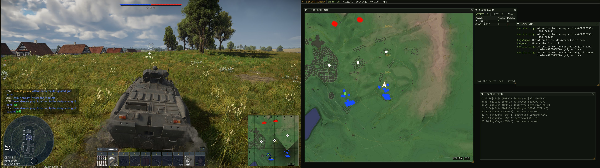
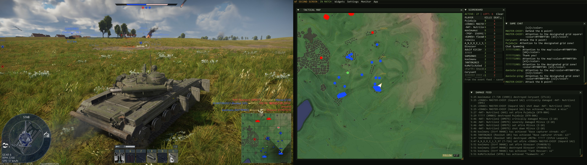

# War Thunder Intelligent UI
Initial release — alpha 0.1

Disclaimer

This is an unofficial fan-made tool, not affiliated with, endorsed by, or connected to Gaijin Entertainment. War Thunder is a trademark of Gaijin Entertainment. This tool only reads the localhost interface that the game itself provides for second-screen use.
War Thunder Intelligent UI

# War Thunder Intelligent UI — Features & Advantages

**War Thunder Intelligent UI** transforms your second monitor into a real-time tactical
station for War Thunder. It is built exclusively on the game's official local telemetry
interface (`localhost:8111`) — no memory reading, no code injection, no overlay hooks,
and therefore no risk to your account.

Tactical map, instruments, live scoreboard, ghosts and proximity alerts for War Thunder — on your second monitor.

Native Windows app (C++ / Dear ImGui / DirectX 11). It reads the game's official local telemetry server (localhost:8111): no memory reading, no injection, no ban risk. It only shows enemies the game has already spotted — the same information as the in-game minimap.

Why not just open localhost:8111 in a browser?

War Thunder ships a basic web page on localhost:8111 (map + simple flight instruments). This app uses the same data source, but turns it into an actual second-screen tool:

## Core Advantages

- **100% safe by design** — reads only the localhost interface that the game itself
  provides for second-screen use. It never touches the game process.

- **Fair play guaranteed** — displays only information the game already gives you:
  spotted enemies, your own telemetry, and public match events. It is an awareness
  tool, not a cheat.

- **Native performance** — a single lightweight executable (~1 MB) written in C++
  with Dear ImGui and DirectX 11. Instant startup, minimal CPU and memory footprint,
  smooth 60 FPS rendering.

- **Zero installation** — one portable exe. No installer, no runtimes, no dependencies.
  All configuration lives in small files next to the executable.

- **Free and open source** — full source code available; anyone can audit, build,
  or improve it.

---

## Tactical Map

- Full-size, high-resolution tactical map with smooth zoom and pan.

- **FOLLOW mode** — keeps the map permanently centered on your vehicle.

- **Ghost markers** — when a spotted enemy disappears, a fading marker remains at its
  last known position, labeled with its age in seconds. Vanished contacts stay useful
  for up to 45 seconds.

- **Real-world distances** — meter-accurate labels on every spotted enemy, computed
  from the map's true dimensions.

- **Measuring ruler** — hold the right mouse button to measure any distance on the map.

- **Range rings** — optional 200 / 500 / 1000 m rings centered on your vehicle for
  instant engagement-range estimation.

- **Proximity alarm** — configurable distance threshold; when a spotted enemy enters
  it, the map border flashes red and an audible alert is triggered.

- Automatic map reload at the start of every match.

---

## Match Intelligence

- **Live scoreboard** — kills, deaths, active players and leavers, parsed in real time
  from the match event feed. Resets automatically every round.

- **Session history** — every match is archived to `session_stats.csv` for later review.

- **Damage feed** — a scrolling, timestamped log of every kill and event in the match.

- **Game chat** — the full in-game chat, mirrored on your second screen.

- **Mission objectives** — live objective list with completion status.

---

## Flight & Vehicle Instruments

- Large, readable displays for **speed** (IAS/TAS), **altitude**, **heading** with
  cardinal directions, **climb rate**, and **throttle**.

- **Fuel gauge** with remaining kilograms, percentage bar, and low-fuel warning.

- **Engine panel** — oil and water temperatures with overheat warnings, current
  G-load, and an **estimated fuel time** calculated from your real consumption.

- **Vehicle display** showing the current vehicle and type.

---

## Customization

- **Fully modular layout** — every panel is an independent window: drag, resize,
  or close any of them. The layout saves itself automatically.

- **Widgets panel** — enable or disable every window from a single checkbox list.

- **Theming** — pick your own window color and accent color; the entire interface
  adapts automatically.

- **Adjustable marker size** — scale all map markers from 0.5× to 3×.

---

## Multi-Monitor & Controls

- **Monitor selection** — the app opens borderless fullscreen on the monitor you
  choose and remembers it.

- **Always-on-top** option.

- **Global hotkeys** — zoom the map (Numpad + / −) and toggle FOLLOW (Numpad *)
  without ever leaving the game window.

---

## Compared to the Stock localhost:8111 Web Page

The game's built-in web page offers a fixed map view and basic gauges inside a browser
tab. War Thunder Intelligent UI uses the same official data source and adds everything
above: ghosts, real distances, measuring tools, alarms, a live scoreboard with history,
a fully customizable layout, theming, true multi-monitor support, and global hotkeys —
all in a native application instead of a browser tab.
Support

If this tool helps you, you can buy me a coffee via PayPal ☕
https://paypal.me/izansorce86

